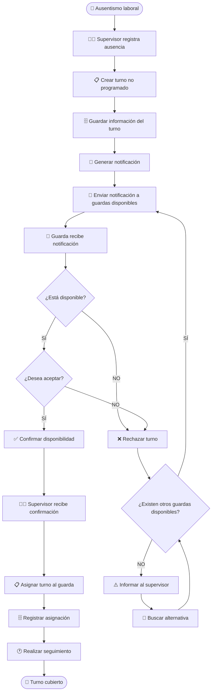

# 📱 Flujo del sistema

Este diagrama representa el funcionamiento general propuesto para el aplicativo móvil de cobertura de turnos no programados.

```mermaid
flowchart TD

A([🚨 Ausentismo laboral]) --> B[👨‍💼 Supervisor registra ausencia]

B --> C[📋 Crear turno no programado]

C --> D[🗄️ Guardar información del turno]

D --> E[📢 Generar notificación]

E --> F[📱 Enviar notificación a guardas disponibles]

F --> G[👮 Guarda recibe notificación]

G --> H{¿Está disponible?}

H -->|NO| I[❌ Rechazar turno]

H -->|SÍ| J{¿Desea aceptar?}

J -->|NO| I

J -->|SÍ| K[✅ Confirmar disponibilidad]

K --> L[👨‍💼 Supervisor recibe confirmación]

L --> M[📋 Asignar turno al guarda]

M --> N[🗄️ Registrar asignación]

N --> O[🕐 Realizar seguimiento]

O --> P([🏁 Turno cubierto])

I --> Q{¿Existen otros guardas disponibles?}

Q -->|SÍ| F

Q -->|NO| R[⚠️ Informar al supervisor]

R --> S[🔎 Buscar alternativa]

S --> Q
```
