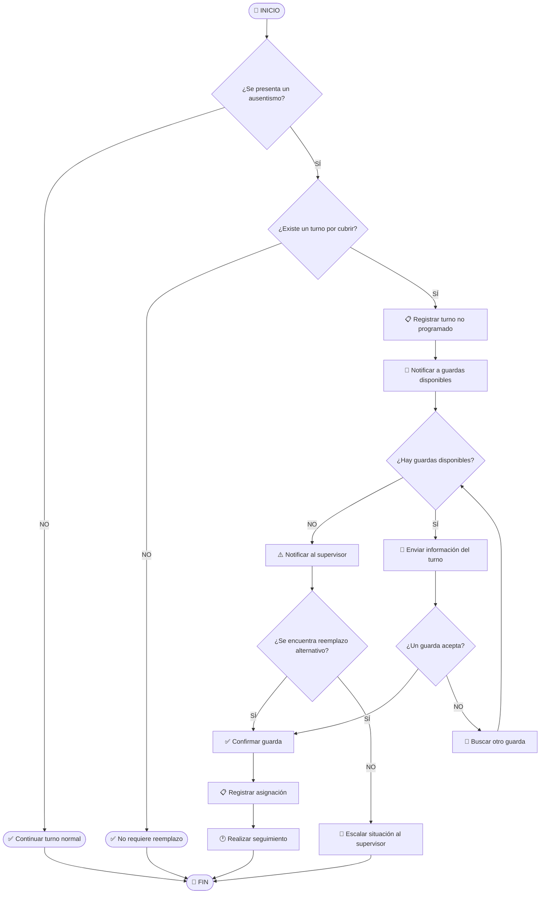

# 🌳 Árbol de decisiones

Este diagrama representa el proceso de decisión para gestionar la cobertura de un turno no programado generado por ausentismo laboral.

```mermaid
flowchart TD

A([🚨 INICIO]) --> B{¿Se presenta un ausentismo?}

B -->|NO| C([✅ Continuar turno normal])

B -->|SÍ| D{¿Existe un turno por cubrir?}

D -->|NO| E([✅ No requiere reemplazo])

D -->|SÍ| F[📋 Registrar turno no programado]

F --> G[📢 Notificar a guardas disponibles]

G --> H{¿Hay guardas disponibles?}

H -->|NO| I[⚠️ Notificar al supervisor]

H -->|SÍ| J[📱 Enviar información del turno]

J --> K{¿Un guarda acepta?}

K -->|SÍ| L[✅ Confirmar guarda]

K -->|NO| M[🔄 Buscar otro guarda]

M --> H

L --> N[📋 Registrar asignación]

N --> O[🕐 Realizar seguimiento]

O --> P([🏁 FIN])

I --> Q{¿Se encuentra reemplazo alternativo?}

Q -->|SÍ| L

Q -->|NO| R[🚨 Escalar situación al supervisor]

R --> P

C --> P
E --> P
```
